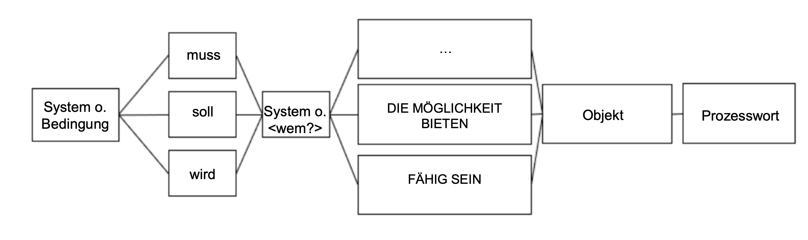
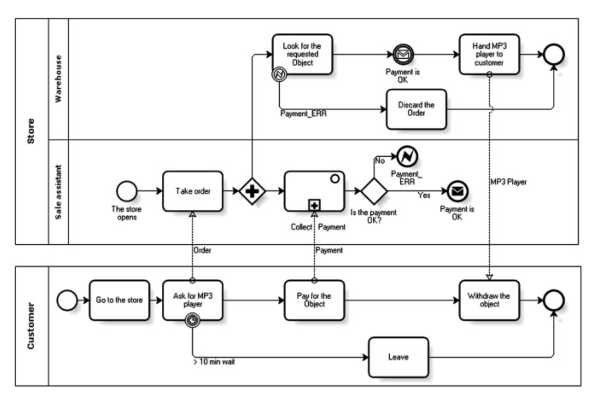
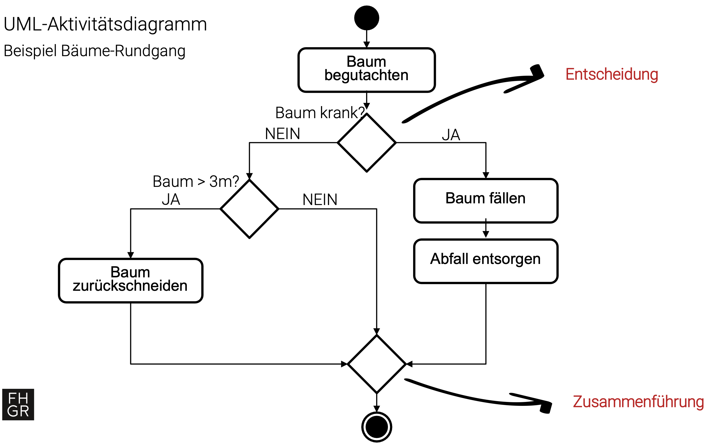
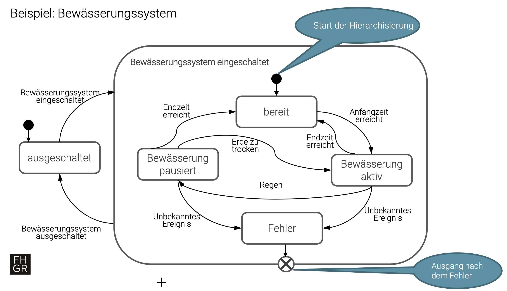
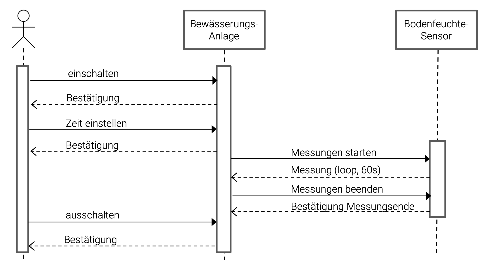
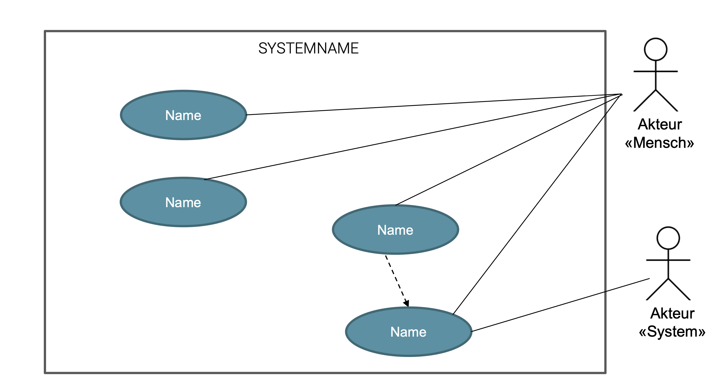
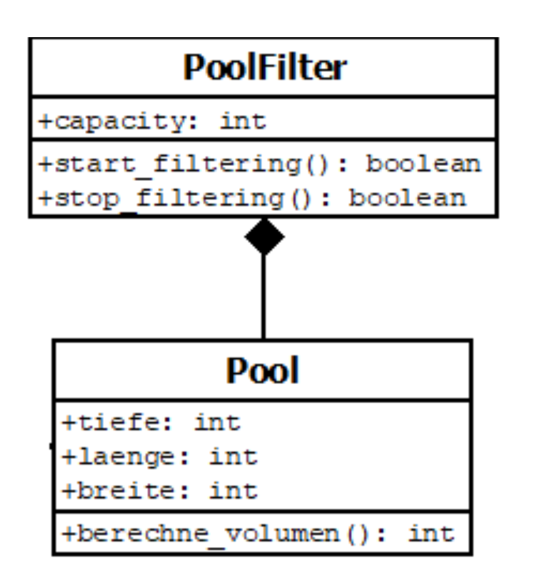
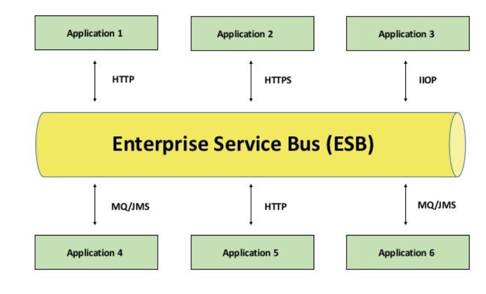

---
titlepage: true
titlepage-color: "ffffff"
titlepage-rule-color: "ffffff"
titlepage-text-color: "000000"
toc-own-page: true
colorlinks: false
title: Zusammenfassung Software Architecture and Design 
author:
  - Yannick Hutter
lang: de
date: "21.06.2024"
lof: true
toc: true
mainfont: SF Pro Display 
sansfont: SF Pro Display 
monofont: JetBrainsMono Nerd Font
header-left: "\\small \\thetitle"
header-center: "\\small \\leftmark"
header-right: "\\small \\theauthor"
footer-left: "\\leftmark"
footer-center: ""
footer-right: "\\small Seite \\thepage"
...

\newpage

# Grundbegriffe

## Software Architektur und Design
Software Architektur und Design beziehen sich auf die Organisation und die Struktur von Software Systemen um die Qualität und Wartbarkeit sicherzustellen.

## Software Architektur
Konzentriert sich auf die Gestaltung und Definition der grundlegenden Strukturen, Komponenten und Schnittstellen des Systems

## Design
Umfasst die konkreten Details der Umsetzung.

## Anforderungen

> Für einen Garten welcher zur Erholung dienen soll sind dies beispielsweise die Wahl der Terasse, Möbel und schöne Pflanzen

Sind spezifische Bedürfnisse, Erwartungen oder Voraussetzungen die an ein System gestellt werden. Sie beschreiben was das System **leisten oder erfüllen** muss um als erfolgreich angesehen zu werden.

## Modellierung

> Bei einem Garten wäre dies die Skizze in dem man die verschiedenen Elemente wie Bäume etc. darstellt

Schaffung von **abstrakter Darstellungen von Systemen*, die später in konkrete Software-Designs umgesetzt werden. Ermöglicht das System aus verschiedenen Perspektiven zu betrachten um wichtige Entscheidungen über die Architektur zu treffen.

## Architekturstyl

> Bei einem Garten ist dies der Gartentyp (englischer, französischer Garten etc.)

Definiert auf hoher Ebene, wie ein System aufgebaut ist und wie die Komponenten miteinander interagieren.

## Schichtenmodell

Ist ein Architekturkonzept bei dem eine Anwendung in Schichten unterteilt wird, die schichten sind **hierarchisch** aufgebaut und **bilden eine Gesamtlösung**. Jede Schicht erfüllt eine bestimmte Aufgabe und kommuniziert nur mit den **direkt benachbarten Schichten**.

## Komponenten

> Beim Garten besteht das Bewässerungssystem aus verschiedenen Komponenten (Wasserpumpe, Schlauch etc.). Jeder dieser Komponenten hat eigene Aufgaben

Eine Komponente ist ein unabhängiges wiederverwendbares Modul, das eine oder mehrere zusammenhängende Funktionen bereitstellt.

## Design Patterns

> Erfahrene Gärtner wenden für eine Problemstellung immer ein spezifisches Muster an (bspw. Schneiden eines Bonsai)

Ist eine bewährte Lösung für ein bestimmtes wiederkehrendes Problem im Software-Design

## Abstraktion

> Anstatt jede Pflanze individuell zu betrachten, abstrahiert man sie zu einer Gruppe mit gemeinsamen Merkmalen.

Ist ein Prinzip um komplexe System durch Reduktion **auf ihre wesentlichen Merkmale** zu vereinfachen, um sie besser verstehen und verwalten zu können.

## Kopplung

> Gartenbereiche sind mit verschiedenen unabhängigen Elementen im Garten wie Wege oder Wasserläufe verbunden.

Beschreibt wie stark und auf welche Art und Weise Module oder Komponenten eines Systems voneinander abhängig sind.

## Kohesion

> In einem gut gestalteten Garten harmonisieren die verschiedenen Pflanzenarten in Bezug auf Form, Farbe, Grösse etc.

Stellt sicher, dass Elemente welche zusammengehören in einer Komponente gruppiert sind und das eine Komponente nur eine klare und zusammenhängende Funktionalität ausführt.

# Nutzen von Software Architektur

- Effektivität: Eine gute Architektur gewährleistet dass das System seinen Zweck erfüllt
- Effizienz: Gewährleistet optimale Leistung und optimaler Ressourcenverbrauch
- Leichte Wartbarkeit: Einfache Identifikation von Fehlern 
- Erweiterbarkeit: Leichtes Hinfzufügen und Ändern von Funktionalitäten
- Skalierbarkeit: Einfache Skalierung und Anpassung an steigende Anforderungen
- Zusammenarbeit: Leichte Zusammenarbeit anderer Teammitglieder (verstehen das System und können es auch pflegen)
- Sicherheit: Schutz vor Angriffen und Datenverlust
- Wiederverwendbarkeit: Einfache Wiederverwendung von Komponenten und Funktionalitäten
- Kosteneffizienz: Senkung der Entwicklungs- und Wartungskosten

# Symptome einer schlechten Architektur

- Verzögerung oder Probleme bei der Implementierung von neuen Funktionen
- Hoher Zeitaufwand für Änderungen am System
- Budgetüberschreitung in Projekten
- Hohe Wartungskosten
- Instabilität und mangelhafte Performance

# Anforderungsdesign

> Fast jedes zweite IT- oder Softwareprojekt scheitert, weil Anforderungen nicht klar definiert und dokumentiert werden.

\newpage

## Anforderungsanalyse (Requirements Engineering)

> Ist ein kooperativer Prozess welche verschiedene Stakeholder involviert

Ist die systematische Ermittlung und Dokumentation von Anforderungen. Zusätzlich werden Anforderungen geprüft und verwaltet.

## Requirements Management
Ist eine Teildisziplin des Requirements Engineerung und befasst sich primär mit dem **Verwalten von Anforderungen**.

## Anforderungsanalyse
Die Anforderungsanalyse wird benötigt um:

- Verständlich zu beschreiben was in einem Projekt erwartet wird und welche Randbedingungen gelten
- Reduziert das Risiko dass die Stakeholder am Ende des Projektes mit dem Ergebnis nicht zufrieden sind
- Aufwand der Anforderungsanalyse soll dem akzeptierbarem Risiko angemessen sein
- Je später ein Fehler entdeckt wird, desto teurer die Behebung

## Anforderungsspezifikation
Ist die Zusammenstellung aller Anforderungen an eine Software. Das Lastenheft beschreibt die Anforderungen **aus Sicht des Kunden**, das Pflichtenheft beschreibt die Anforderungen **aus Sicht des Projektteams**.

## Ermittlung von Anforderungen
Anforderungen können auf folgende Art und Weise ermittelt werden:

- Studium von Dokumenten
- Befragung von Stakeholdern und Beobachtung von Prozessabläufen
- User Stories
- Design Thinking
- Prototypen anfertigen und testen lassen

## Merkmale einer guten Anforderungsspezifikation

- Adäquat: beschreibt das, was der Kunde will
- Vollständig: beschreibt alles, was der Kunde will
- Widerspruchsfrei
- Verständlich: für alle Beteiligten verständlich
- Eindeutig: vermeidet Fehler durch Fehlinterpretationen
- Prüfbar: man kann feststellen ob das zu realisierende System die Anforderungen erfüllt
- Risikogerecht: Umfang entspricht dem in Betracht gezogenem Risiko

## Anforderungsschablone

> Beispiel mit Bedingung: Falls die Lichtverhältnisse unter 750 Lux fallen, müssen die Gartenleuchten automatisch angehen

Ist ein Bauplan für die Struktur eines einzelnen Anforderungssatzes, sie hilft dabei:

- Anforderungen im Aktiv und als vollständige Sätze zu schreiben
- Anforderungen welche Prozesse betreffen, mit Hilfe von Vollverben zu beschreiben

## Arten der Anforderungen

- Sachziele: Der Garten muss dem Nutzer die Möglichkeit bieten, zu baden.
- Funktionale Anforderungen: Der Pool muss die Möglichkeit bieten, beheizt zu werden
- Leistungsanforderungen (Nicht-funktional): Der Pool muss in weniger als 3 Stunden auf 28°C aufheizbar sein
- Randbedingungen (Nicht-funktional): Der Pool darf maximum CHF 30'000 kosten
- Besondere Qualitäten (Nicht-funktional): Der Pool muss mit Edelmaterialien gebaut werden

## Attribute

- ID
- Titel
- Beschreibung
- Abhängig von

# Modellierung

> Ein Modell ist ein vereinfachtes Abbild der Wirklichkeit

## Modellierungssprachen
Eine Modellierungssprache enthält eine Menge von Elementen, welche bestimmte prozessrelevante Aspekte repräsentiert. Geschäftsprozessmodelle werden mit Modellierungssprachen erstellt. Eine Modellierungssprache definiert:

- Syntax: wie stehen die Elemente miteinander in Beziehung
- Notation: wie werden die Elemente grafisch dargestellt
- Semantik: welche Bedeutung haben die Elemente

\newpage

### BPMN
Die Business Process Modell and Notation ist die am **weitesten verbreitete Prozessmodellierungssprache**. Sie wird hauptsächlich für das Modellieren von Geschäftsprozessen und ausführbaren Prozessen eingesetzt.

{heigth=450px}

## Aktivitätsdiagramm

\newpage

## Zustandsdiagramme
Sind ein Werkzeug, um das **Verhalten von Systemen** in verschiedenen **Zuständen** zu beschreiben.

- Modelliert den Lebenszyklus eines Objekts
- Zeigt Zustände, Ereignisse und Übergänge zwischen Zuständen
- Hilft bei der Analyse von Zustandsabhängigkeiten

\newpage

## Sequenzdiagramme
Ist eine grafische Darstellung von **Interatkion zwischen Objekten in einem System**

- Zeigt die Reihenfolge und den zeitlichen Ablauf von Interaktionen zwischen Objekten
- Konzentriert sich auf den Nachrichtenaustausch zwischen Objekten
- Hilft bei der Analyse von Interatkion zwischen Objekten

\newpage

## Use Case

> Muss-Bedingungen werden mit **include**, optionale Bedingungen mit **extends** modelliert.

- Beschreibt die Interatkion zwischen System und externen Akteuren
- Konzentriert sich auf die Funktionalität und Ziele des Systems

### Vorteile

- Geben auf hohem Abstraktionsniveau einen sehr guten Überblick über das Gesamtsystem und über die Funktionen
- Use-Case-Diagramme nehmen eine **Benutzerperspektive** ein
- Aufgrund der Einfachheit gut zur Kommunikation zwischen Auftraggeber und Auftragnehmer geeignet

### Nachteile

- Use Case Diagramme beschreiben kein Verhalten und keine Abläufe
- Es wird keine Reihenfolge festgelegt
- Nicht-funktionale-Anforderungen lassen sich hiermit nicht abbilden

### Komponenten

- Use-Case: Beschreibt ein Verhalten des Systems, das einem Nutzer zur Verfügung gestellt wird
- System: Ist die Einheit, die das Verhalten, das durch Use-Cases beschrieben wird, realisiert und anbietet
- Aktuer: Interagiert mit den Use-Cases des Systems und steht immer ausserhalb davon

# Domain Driven Design
Ist eine Methode zur Entwickklung **komplexer Softwaresysteme**, sie sich auf das Verständnis und die Modellierung der Geschäftsdomäne konzentriert. Basiert auf der Idee, dass die Domäne das **Herzstück** eines Softwaresystems ist und die Software die Domäne wiederspiegeln sollte, anstatt sich auf technische Aspekte zu konzentrieren. DDD hilft bei der **Bewältigung von Komplexität** da man sich auf das Wesentliche konzentriert und unnötige Abhängigkeiten vermeidet.

## Domain Modell
Ist das Kernkonzept von DDD und beschreibt die **zentralen Geschäftsprozesse eines Unternehmens**. Das Domain Modell ist eine **abstrakte Darstellung der Geschäftsdomäne** und beinhaltet folgende Elemente:

- Ubiquitous Language
- Context Boundaries
- Aggregates
- Aggregate Roots
- Entities
- Value Objects
- Events

### Ubiquitous Language
Beschreibt eine **gemeinsame Sprache**, die von allen Beteiligten verwendet wird, um Geschäftsprozesse zu beschreiben. Dies stellt sicher das:

- Missverständnisse vermieden werden
- Sicherstellung das das System alle Anforderungen der Geschäftsdomäne erfüllt

### Bounded Context
Ist ein klar **abgegrenzter Bereich** innerhalb der Geschäftsdomäne, indem eine spezifische Ubiquitous Language (UL) verwendet wird.

- Vermeidung dass die UL in der gesamten Domäne zu komplex wird
- Verschiedene Teil des Systems können unbhängig voneinander entwickelt werden

Für die **Beschreibung eines Bounded Context** werden folgende Elemente verwendet:

- Kontextname
- Beschreibung
- Entitäten
- Beschreibung von Geschäftsprozessen sowie ihrer Ziele und Einschränkungen
- Schnittstellen innerhalb des Bounded Context und welche ausserhalb vorhanden sind
- Beschreibunf der Daten welche gespeichert werden

### Context Boundaries

> Definition erfolgt in Zusammenarbeit mit Stakeholdern und Experten der Domain

Definieren was innerhalb eines Bounded Context gehört und was ausserhalb liegt. Sie dienen zur Steigerung der Kohäsion und verhindern, dass die Modelle zu komplex werden.

### Context Mapping

Dient dazu Beziehungen und Abhängigkeiten zwischen **verschiedenen Bounded Contexts** zu identifizieren und zu dokumentieren:

- Shared Kernel (gemeinsames Kernmodell): bestimmte Teile des Domain-Modelles können zwischen verschiedenen Bounded Contexts geteilt werden
- Partnership: Enge Zusammenarbeit von 2 Bounded Contexts mit gemeinsamen Zielen
- Customer-Supplier: Ein Bounded-Context bezieht Daten oder Dienste von einem anderen Bounded Context
- Conformant mapping: Beschreibt die Zuordnung von Daten aus einem Quellsystem zu einem Zielsystem. Wird primär für Datenintegration benötigt

### Aggregates
Aggregates helfen dabei die Zusammengehörigkeit und die Grenzen zwischen Objekten und Entitäten **innerhalb eines bestimmten Kontexts** zu definieren. Ein Aggregate besteht aus mehreren Objekten, die zusammen eine klare Einheit bilden. Das **Aggregate Root** gibt dem Kontext seine Identität und ist für die Überwachung der Integrität zuständig. Aggregate und Aggregate Root tragen dazu bei die direkte Beziehung zwischen den Entitäten zu verringern:

- Reduzieren der Komplexität
- Helfen, Schnittstellen zwischen Aggregate zu definieren

Hierzu ein Beispiel anhand eines Gartens:

- Der Garten ist der Bounded Context und umfasst alle Elemente die zum Garten gehören (bspw. Pflanzen, Bäume, Gras etc.)
- Der Poolbereich ist ein Teil des Gartens und kann als eigenständiges Aggregate betrachtet werden
- Die zentrale Steuerungsanalge für den Pool-Bereich kann als Aggregatewurzel fungieren

### Entitäten
Sind **Informationsobjekte mit einer eindeutigen Identität**. Sie haben auch Eigenschaften welche sich im Laufe der Zeit ändern können

### Value Objects

> Werden häufiger als Teil von Entitäten verwendet

Werteobjekte ohne Identität, werden nur durch ihre Eigenschaften definiert. Sie sind unveränderlich und sollten sich im Laufe der Zeit nicht ändern.

### Repository Interface

> Das Ziel ist es die Domain von der Datenbank-Schicht zu entkoppeln

Ist eine Schicht zwischen der Domain und der Datenbank und stellt eine Abstraktionsebene für den Zugriff auf die Daten bereit.

### Events
Ist eine Nachricht, die angibt, dass etwas in der Domäne passiert ist. Beinhalten nebst dem Event Typ normalerweise weitere Informationen über den Zustand des Systems vor und nach dem Ereignis.

### Erfolgsfaktoren

- Kultur der Zusammenarbeit und des Wissensaustausch
- Übermodellierung vermeiden
- Tests und Feedback

# Klassendiagramm
Ein Klassendiagramm ist eine grafische Darstellung von Klassen, Attributen und Methoden einer Softwareanwendung und ihrer Beziehungen zueinander.

## Beziehungen

- Assoziation: Eine Verbindung zwischen zwei Klassen, die eine logische Beziehung darstellt
- Aggregation (weiss): Beziehung zwischen Klassen, bei der eine Klasse eine Teilmenge einer anderen Klasse darstellt
- Komposition (schwarz): Spezielle Form von Aggregation, bei der ein Teilobjekt eng mti dem Ganzen verbunden ist und ohne das Ganze nicht existieren kann

Eine Komposition zwischen einem Pool und einem Poolfilter könnte angeben, dass der Pool den Poolfilter besitzt und ohne Poolfliter nicht existieren kann.

{height=200px}

# Versionskontrolle
Eine Versionskontrolle ist eine Software, welche **Änderungen an Dateien** über die Zeit verfolgt und speichert. Sie ermöglicht es mehreren Personen gleichzeitig am Projekt zu arbeiten, ohne dass dabei Konflikte entstehen.

## Zentrale Versionsverwaltungssysteme
Zu den zentralen Versionsverwaltungssystemen gehören bspw. Subversion und CSV:

- Positiver Aspekt: Ermöglicht eine klare Versionshistorie
- Negatier Aspekt: Abhängigkeit vom zentralen Server, d.h. mögliche Engpässe und Verfügbarkeitsprobleme

## Verteilte Versionsverwaltungssysteme
Hierzu zählt Git:

- Positiver Aspekt: Hohe Flexiblität, Branches können leicht erstellt und zusammengeführt werden
- Negativer Aspekt: Komplexer in der Handhabung

# Architekturstyle
Ein Architekturstyl beschreibt ein abstraktes Konzept zur Organisation eines Software-Systems und umfasst sowohl seine Struktur als auch seine Verhaltensweisen.

## Vorteile

- Konsistenz: Sorgt für konsistente Struktur für das gesamte System
- Wiederverwendbarkeit: Kann wiederverwendbare Lösungen für häufige Probleme bereitstellen und so Entwicklungszeit verkürzen
- Kommunikation: Gemeinsame Sprache für das Entwicklungsteam und andere Stakeholder zu etablieren

## Monolithische Architektur

> Monolithische Architektur sollte vermieden werden, wenn die Anwendung wächst und komplexer wird, da sich Änderungen immer auf das gesamte System auswirken

Alle Komponenten innerhalb einer Anwendung werden als ein grosser zusammenhängender Block ausgeführt:

- Einfacher zu verstehen
- Ausreichend wenn die Anwendung nicht stark skalieren muss
- Geringer Netzwerk Overhead, da alles auf dem selben System läuft
- Weniger Fehlerquellen da es weniger Schnittstellen und Abhängigkeiten gibt
- Günstiger, da weniger Infrastruktur benötigt wird.

## Client-Server-Architektur
Ist eine Architektur die die Interaktion zwischen Clients und Servern beschreibt. Der Client sendet hierbei Anfragen an den Server. Der Server nimmt diese entgegen und sendet entsprechene Antworten zurück.

Die Client-Server-Architektur ist sinnvoll wenn:

- die Anwendungslogik auf einem zentralen Server ausgeführt werden soll
- die Anwendung von einer Vielzahl von Clients mit unterschiedlichen Geräten und Betriebssystemen verwendet werden soll
- eine bessere Sicherheit der Daten gewährleistet werden soll

## Webanwendung
Ist eine spezielle Form der Client-Server-Architektur. Der Client ist hier in der Regel ein Webbrowser und der Server ist über das Internet/Intranet erreichbar. Eine Webanwendung ist sinnvoll wenn:

- die Anwendung von einer grossen Anzahl von Nutzern über das Internet genutzt werden soll
- die Anwendung plattformunabhängig ist und ohne Installation von Software auf dem Client genutzt werden soll
- die Anwendung häufig aktualisiert oder erweitert werden soll

\newpage

## Verteilte Systeme
Ist eine Architektur bei der die Komponenten der Anwendung auf **verschiedene physikalische oder virtuelle Systeme** vereilt sind und über das Netzwerk kommunizieren. Sie bietet folgende Vorteile:

- Skalierbarkeit
- Flexibilität
- Robustheit gegen Ausfallsicherheit

## Service-Oriented Architektur (SOA)

> Eignet sich für Unternehmen, wenn eine Vielzahl von komplexen Anwendungen und Legacy-Systemen besteht, die miteinander kommunizieren müssen

Ist eine Art von verteilter Systemarchitektur, bei der die **Anwendungen aus Services bestehen** die lose gekoppelt und unabhängig voneinander betrieben werden können. Dabei wird die Funktionalität der Anwendung als Dienst bereitgestellt, der von anderen Anwendungen aufgerufen werden kann. SOA ist sinnvoll wenn:

- es eine Vielzahl von Anwendungen gibt, die miteinander kommunizieren müssen
- Anwendungen auf verschiedene Plattformen und Technologien aufgebaut sind
- Anwendungen unabhängig voneinander entwickelt und gewartet werden müssen

Die Dienste selbst sind als **wiederverwendbare Komponenten implementier**:

- leicht erweiterbar und austauschbar
- schnelle Reaktion auf sich ändernde Geschäftsprozesse

Die Kommunikation der SOA geschieht über einen **Enterprise Service Bus (ESB)**. Über diesen Service Bus lassen sich unterschiedliche Schnittstellen anbinden, indem für jedes System ein Adapter gebaut wird.

{height=150px}

## Micro-Service Architektur

> Eignet sich für Unternehmen, die schnell skalieren und Agilität benötigen

Basiert auf der Idee, eine Anwendung als eine **Sammlung kleiner, unabhängiger und lose gekoppelter Services zu gestalten**:

- Skalierbarkeit
- Flexibilität
- Jeder Service kann in einer beliebigen Technologie/Programmiersprache entwickelt werden, solange die definierte Schnittstelle beachtet wird
- Bessere Fehlertoleranz, d.h. ein Ausfall betrifft nur den einzelnen Service und nicht das ganze System

Im Gegensatz zu SOA **geschieht die Kommunikation über eine REST Schnittstelle**.

## Event-Driven Architecture (EDA)
Systeme kommunizieren mithilfe von Events untereinander. Das System besteht aus folgenden Komponenten:

- Event Producern: Erzeugen Events
- Event Bus: Nimmt Events entgegen und leitet diese an die Event Consumer weiter
- Event Consumer: Konsummieren Events

Eine Event-Driven Architektur sollte angewendet werden wenn:

- Es wichtig ist, auf Änderungen in Echtzeit zu reagieren
- Das System komplexer ist und aus mehreren unabhängigen Komponenten besteht
- Die Verarbeitung von Events unabhängig von der Quelle oder dem Empfänger des Events erfolgen kann

\newpage

### Technologien

- **Messaging-Systeme**: Baut einen asynchronen Nachrichtenaustausch auf. Apache Kafka, RabbitMQ können genutzt werden um Events zwischen den verschiedenen Komponenten auszutauschen
- **Stream-Processing-Systeme**: Es geht nicht rein um das Austauschen von Events, sondern auch um die Verarbeitung. Apache Spark Streaming oder Flink können genutzt werden um Events in Echtzeit zu verarbeiten und daraus neue Events zu erzeugen
- **Event-Sourcing-Systeme**: Es werden nicht nur die aktuellen Zustände sondern auch alle vergangenen Events gespeichert. So kann der Zustand jederzeit wiederhergestellt werden

## Container Architektur

> Beliebte Container Technologien sind bspw. Docker und kubernetes

Anwendungen werden als eine Sammlung von miteinander verbundenen, unabhängigen Containern implementiert. Jeder Container erhält eine spezifische Komponente der Anwendung und ist in der Regel in der Lage, **unabhängig von anderen Containern** zu arbeiten:

- Skalierbarkeit: Es können gezielt bestimmte Container hochskaliert werden
- Flexibilität bei der Wahl der Technologie und der Frameworks
- Portabilität: Container sind so konzipiert, dass sie unabhängig vom Betriebssystem funktionieren

## Schichtenarchitektur
Das System wird in verschiedene Schichten aufgeteilt. Jede Schicht hat hierbei **eine spezifische Funktionalität und kann nur auf die unmittelbar darüberliegende, bzw. darunterliegende Schicht zugreifen**:

- Vereinfachung der Komplexität
- Erleichterung der Wartung und Erweiterbarkeit durch klare Abhängigkeiten und Schnittstellen
- Möglichkeit zur Wiederverwendung von Schichten in anderen Projekten
- Skalierbarkeit
- Sicherheit: Unauthorisierter Zugriff wird durch Sicherheitsschichten abgeriegeltl

\newpage

## Model-View-Controller (MVC)
Das **Model** enthält die Geschäftslogik und die Datenhaltung. Die **View** stellt die Benutzeroberfläche dar. Der **Controller** nimmt Eingaben vom Benutzer entgegen und aktualisiert das Model und die View entsprechend:

- Trennung von Präsentation und Geschäftslogik für eine bessere Wartbarkeit
- Wiederverwendbarkeit von Code
- Anwendung ist leichter zu testen

# Tests
Tests stellen sicher dass das System erwartungsgemäss funktioniert und umfassen folgende Punkte:

- Verifizierung: Überprüft ob das System wie erwartet funktioniert und den Anforderungen entspricht
- Validierung: Überprüft ob das System den Bedürfnissen und Erwartungen der Benutzer entspricht
- Fehlererkennung und Fehlerbehebung
- Qualitätssicherung: Sicherstellen dass das System den erforderten Qualitätsstandards entspricht
- Dokumentation: Dokumentieren von Testergebnissen und Berichten über Mängel und Probleme

## Testmanagement
Beinhaltet alle Aktivitäten rund um die **Organisation von Tests und Gestaltung von Testprozessen**:

- Test-Planning
- Test-Authoring: Erstellung von Testfällen oder automatisierten Tests
- Test-Execution
- Test-Tracking: Nachvollziehbarkeit von Testergebnissen, Bewertung von Qualitätsmetriken
- Test-Reporting: Visualisierung und Kommunikation der Testergebnisse

\newpage

## Rollen

### Primäre Rollen

- **Testmanager**: Verantwortlich für die Planung, Durchführung und Überwachung des Testprozesses
- **Tester**: Führt die Tests gemäss den Testfällen durch
- **Testautomatisierungsspezialist**: Verantwortlich für die Automatisierung von Tests zur Verbesserung der Effizienz

### Sekundäre Rollen

- **Testkoordinator**: Unterstützt den Testmanager bei der Koordination der Testaktivitäten
- **Testanalyst**: Analyse von Testergenbissen um Defekte und deren Ursache zu finden
- **Testumgebungsspezialist**: Verantwortlich für die Bereitstellung und Wartung von Testumgebungen
- **Testdatenmanager**: Verantwortlich für die Erstellung und Verwaltung von Testdaten

## Testfall
Ist eine Anweisung, die beschreibt, wie ein bestimmter Aspekt einer Software getestet werden soll. Testfälle werden nach dem **Arrange-Act-Assert-Muster** geschrieben:

- **Arrange**: Die Bewässerungsanalyse ist installiert und funktionsfähig
- **Act**: Der Benutzer stellt die Bewässerungszeit auf 10 Minuten ein und drückt den Startknopf
- **Assert**: Das Wasser fliesst für genua 10 Minuten und stoppt automatisch

## Test Suite
Ist eine Sammlung von **mehreren Testfällenwelche zusammen ausgeführt werden**.

## Test-Pyramide
Beschreibt wie Tests in Gruppen unterschiedlicher Granularität eingeteilt werden können:

- Unit Tests (70% der Tests) oft mittels  automatisierten Tests
- Integration Tests (20% der Tests) oft mittels automatisierten Tests
- End-to-end Tests (10% der Tests), oft mittels manuellen Tests

## Continous Integraiton (CI)
Ist ein Entwicklungsansatz bei dem Codeänderungen regelmäss und automatisch in das gemeinsame Repository eingebungen werden, um Konflikte frühzeitig zu erkennen und so die Qualität des Codes kontinuierlich zu verbessern

## Komponenten-Tests

> Eine Analogie mit einer Gartenbewässerungsanalage wäre der Test der gesamten Anlage.

Sind automatisierte Tests, die prüfen ob mehrere zusammenhängende Code-Module (Komponenten) richtig miteinander interagieren und das erwartete Ergebnis liefern.

## Integrationtests

> In einer Gartenanalogie wären Integrationstests der Test von mehreren Bewässerungsanalagen mit einer zentralisierten Steuerungsanlage. Verschiedene Komponenten werden miteinander integriert und getestet um sicherzustellen dass sie korrekt zusammenarbeiten

Sind Tests, bei denen verschiedene Komponenten einer Anwendung miteinander integriert werden und geprüft wird, ob diese korrekt zusammenarbeiten

## API-Tests
Tests bei der die API Schnittstelle getestet wird um sicherzustellen, dass sie korrekt funktioniert.

## System Tests

> Im Gegensatz zu End-to-End-Tests können Systemtests **spezifische Funktions- oder Komponententests sein**, die das Systemverhalten in einer isolierten Umgebung testen

Tests, die das **Gesamtsystem oder ein Teil des Systems testen**, indem sie die Funktionalität des Systems als Ganzes überprüfen.

\newpage

## End-to-End-Tests

> E2E Tests können manuell oder automatisch durchgeführt werden

Ist ein Test, der den gesamten Geschätsprozesse von Anfang bis Ende durchläuft und dabei alle Komponenten und Systeme einschliesst, die am Prozess beteiligt sind.

## Regressionstests
Sind Tests die sicherstellen, dass Änderungen an einer Software keine **unerwünschten Auswirkungen auf vorhandene Funktionen und Prozesse haben**.

# API
Ist ein Mechanismus, welcher es zwei Softwarekomponenten ermöglicht mithilfe einer Reihe von **Definitionen und Protokolle** miteinander zu kommunizieren. Die API selbst muss folgende Elemente definieren:

- Die Protokolle (HTTPS etc.)
- Die Funktionen welche bereitgestellt werden
- Die Parameter welche übergeben werden müssen
- Die Antworten und Rückgabewerte
- Die Datenformate (JSON etc.)

## Arten von APIs

- Web-APIs: Kommunikation über das Internet (RESTful, SOAP etc.)
- Bibliotheks-APIs: Programmierschnittstellen in Softwarebibliotheken und Frameworks
- Betriebssystem-APIs: Zugriff auf Betriebssystemfunktionen
- Datenbank-APIs
- Cloud-APIs: Zugriff auf Cloud-Dienste und Ressourcen

\newpage

## Lifecycle-Management
Bezeichnet die Verwaltung **des gesamten Lebenszyklus der API**, von der Konzeption über die Entwicklung bis zur Veröffentlichung und Pflege:

- Anforderungsanalyse und Spezifikation
- Design und Entwicklung
- Testing und Qualitätssicherung
- Veröffentlichung und Bereitstellung
- Aktualisierung und Verbesserung
- Entfernung der API wenn sie nicht mehr benötigt wird

## Prinzipien
APIs sollten nach folgenden Prinzipien konzipiert werden:

- Einfachheit: Vermeidung überflüssiger Komplexität
- Konsistenz: Benennen der API-Funktionen nach ihrem Verhalten
- Vollständigkeit: Bereitstellung aller notwendigen Funktionalitäten
- Fehlerbehandlung: Robuste Fehlerbehandlung
- Versionierung: Klare Versionierung der API
- Dokumentation: Gute Dokumentation der API
- Skalierbarkeit
- Sicherheit
- Performanz

## Versionierung
Die Versionierung dient dazu, die API abwärtskompatibel zu gestalten und Änderungen in einer kontrollierten und unterstützten Weise einzuführen:

- Versionsnummer für API-Änderungen verwenden
- Klare Kommunikation über Änderungen und deren Auswirkungen
- Unterstützung mehrerer Versionen gleichzeitig
- Dokumentation der Unterschiede zwischen den Versionen

Unter **Abwärtskompatibilität** ist die Fähigkeit eine neue Version der Software mit älterer Umgebung zu integrieren zu verstehen. Unter **Aufwärtskompatibilität** ist die Fähigkeit eine ältere Version in eine neuere Umgebung zu integrieren zu verstehen.

\newpage

## Sicherheitsaspekte

- Authentifizierung: Identifizierung und Überprüfung der Benutzer via API-Schlüssel, OAuth, JWT
- Autorisierung: Kontrolle der Zugriffsrechte mittels Rollen/Rechte-Konzept
- Verschlüsselung: Schutz der Datenübertragung mittels symmetrischer/asymmetrischer Verschlüsselung (TSL/SSL etc.)
- Rate Limiting: Begrenzung der Anfragehäufigkeit (Verzögerung der Antwort, 429 - Too Many Requests)
- Monitoring und Protokollierung: Überwachung und Aufzeichnung von Aktivitäten
- Sicherheitsrichtlinien: Validierung, Schutz und Einschränkungen

## REST
Beschreibt wie Ressourcen über das HTTP-Protokoll adressiert und manipuliert werden können:

- Client-Server-Architektur: Trennung von Client und Server
- Zustandslosigkeit: Jede Anfrage enthält alle Informationen um die Anfrage komplett zu verstehen
- Ressourcenorientierung: API wird als Sammlung von Ressourcen betrachtet, welche verändert werden können (CRUD)
- Einheitliche Schnittstelle

# Design Patterns
Design Patterns sind bewährte Lösungswege für wiederkehrende Probleme im Softwareentwurf:

- Bieten einen gemeinsamen Ansatz zur Lösugn häufig auftretender Herausforderungen
- Sind Baupläne zur Strukturierung, Organisation und Wartbarkeit von Software
- Schaffen eine gemeinsame Sprache und Kommunikationsbasis für Entwickler

## Creation Patterns
Fokussieren sich auf die **Erzeugung von Objekten** und die zugehörigen Mechanismen um ihre Erstellung zu vereinfachen und flexibler zu gestalten

### Factory Pattern
Bezieht sich auf eine zentrale Klasse, die für die Erzeugung **ähnlicher Objekte unterschiedlicher Klassen** verantworlich ist.

### Factory Method Pattern
Definiert eine abstrakte Methode in einer Basisklasse, die von Unterklassen implementiert wird um verschiedene Instanzen derselben Objektfamilie zu erzeugen.

### Abstract Factory Pattern
Definiert eine abstrakte Fabrik, die eine Reihe von verwandten Objekten erzeugt, ohne ihre konkreten Implementierungen preiszugeben.

### Singleton Pattern
Stellt sicher dass nur eine einzige Instanz einer Klasse existiert und bietet einen globalen Zugriffspunkt darauf an.

### Builder Pattern
Ermöglicht die schrittweise Erstellung komplexer Objekte, indem es den Konstruktionsprozess von der Darstellung des Objekts trennt.

### Prototype Pattern
Ermöglicht das Erzeugen neuer Objekte durch Klonen eines bestehenden Prototyps.

## Structural Patterns
Beschreibt die **Organisation von Klassen und Objekten**, um flexible und effiziente Strukturen zu erstellen

### Adapter Pattern
Ermöglicht die Zusammenarbeit von zwei inkompatiblen Schnittstellen, indem es eine Zwischenschicht bereitstellt, die die Kommunikation zwischen ihnen ermöglicht.

### Bridge Pattern
Trennt die Abstraktionsschicht von ihrer Implementierung, sodass beide unabhängig voneinander geändert werden können.

### Composite Pattern
Ermöglicht die Zusammenfassung von Objekten zu einer Baumstruktur, wobei einzelne Objekte und Gruppen von Objekten einheitlich behandelt werden können.

### Decorator Pattern
Ermöglicht es Objekte zur Laufzeit dynamisch zu erweitern, indem sie mit zusätzlichen Verhaltensweisen oder Attributen umhüllt werden, ohne die ursprüngliche Schnittstelle zu ändern.

### Facade Pattern
Stellt eine vereinfachte Schnittstelle zu einem komplexen Subsystem bereit, indem es die darunterliegende Komplexität versteckt und eine einfache Schnittstelle zum Zugriff auf die verschiedenen Funktionen bietet.

### Flyweight Pattern
Ermöglicht es, den Speicherbedarf zu reduzieren, indem gemeinsame Zustände zwischen ähnlichen Objekten geteilt werden.

### Proxy Pattern
Ermöglicht die Kontrolle des Zugriffs auf ein Objekt, indem es einen Proxy als Vermittler einsetzt

## Behavioural Patterns
Legen das **Verhalten und die Kommunikation** zwischen Objekten fest, um bestimmte Aufgaben oder Abläufe zu realisieren

### Chain of Responsibility Pattern
Ermöglicht die Verknüpfung von Objekten zu einer Kette und die Weitergabe von Anfragen entlang dieser Kette, bis eine geeignete Behandlung gefunden wird.

### Command Pattern
Kapselt eine Anfrage als ein Objekt, wodurch Parametrisierung von Clients ermöglicht und Anfragen in Form von separaten Objekten behandelt werden können.

### Interpretor Pattern
Ermöglicht die Interpretation und Auswertung einer spezifischen Grammatik für komplexe Anfragen oder Ausdrücke.

### Iterator Pattern
Ermöglicht den sequentiellen Zugriff auf die Elemente einer Sammlung, ohne die zugrunde liegende Implementierung offenlegen zu müssen.

### Mediator Pattern
Ermöglicht die Kommunikation und Koordination zwischen mehreren Objekten über ein zentrales Mediatorobjekt, wodurch die direkte Kopplung zwischen den Objekten vermieden wird.

### Memento Pattern
Ermöglicht das Erfassen und Wiederherstellen des internen Zustands eines Objekts.

### Observer Pattern
Ermöglicht eine lose Kopplung zwischen Objekten, indem es eine "ein-zu-viele" Abhängigkeitsstruktur schafft, bei der Änderungen an einem Objekt automatisch an alle abhängigen Objekte
weitergegeben werden.

### State Pattern
Ermöglicht es einem Objekt, sein Verhalten basierend auf seinem internen Zustand zu ändern, indem es das Verhalten in separate Zustandsobjekte auslagert.

### Strategy Pattern
Ermöglicht es, verschiedene Algorithmen oder Verhaltensweisen in separaten Strategieobjekten zu definieren und diese zur Laufzeit auszutauschen, um das Verhalten eines Objekts zu ändern.

### Template Pattern
Definiert den "Skelettcode" eines Algorithmus in einer abstrakten Vorlageklasse und erlaubt den Unterklassen, bestimmte Teile des Algorithmus zu überschreiben, während andere Teile unverändert bleiben.

### Visitor Pattern
Ermöglicht es, neue Operationen zu bestehenden Objektstrukturen hinzuzufügen, indem es die Verantwortung für diese Operationen auf externe Besucherobjekte überträgt, ohne die Klassen der Objekte selbst zu ändern.
